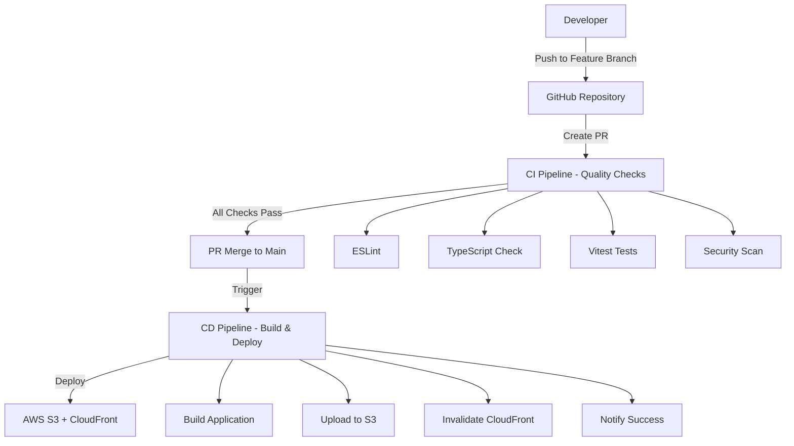

# CI/CD パイプライン設計書

## 概要

GitHub Actions と AWS を使用した CI/CD パイプラインの設計。品質チェックから本番デプロイまでを自動化し、Simple TODO App の継続的インテグレーション・デプロイメントを実現する。

## アーキテクチャ

### 全体構成



### パイプライン構成

#### 1. CI Pipeline (品質チェック)

- **トリガー**: プルリクエスト作成・更新時
- **実行環境**: GitHub Actions (ubuntu-latest)
- **Node.js バージョン**: 18.x (LTS)

#### 2. CD Pipeline (デプロイ)

- **トリガー**: main ブランチへのマージ時
- **実行環境**: GitHub Actions (ubuntu-latest)
- **デプロイ先**: AWS S3 + CloudFront

## コンポーネントと インターフェース

### GitHub Actions ワークフロー

#### CI ワークフロー (.github/workflows/ci.yml)

```yaml
name: CI
on:
  pull_request:
    branches: [main]
jobs:
  quality-checks:
    runs-on: ubuntu-latest
    steps:
      - checkout
      - setup-node
      - install-dependencies
      - lint-check
      - type-check
      - run-tests
      - security-scan
```

#### CD ワークフロー (.github/workflows/cd.yml)

```yaml
name: CD
on:
  push:
    branches: [main]
jobs:
  deploy:
    runs-on: ubuntu-latest
    steps:
      - checkout
      - setup-node
      - install-dependencies
      - build-application
      - configure-aws
      - deploy-to-s3
      - invalidate-cloudfront
      - notify-success
```

### AWS インフラストラクチャ

#### S3 バケット設定

- **バケット名**: `simple-todo-app-production`
- **静的ウェブサイトホスティング**: 有効
- **パブリックアクセス**: CloudFront 経由のみ
- **バージョニング**: 有効（ロールバック用）

#### CloudFront ディストリビューション

- **オリジン**: S3 バケット
- **キャッシュ動作**: SPA 用設定（index.html へのフォールバック）
- **圧縮**: 有効
- **HTTP/2**: 有効

#### IAM ロール・ポリシー

```json
{
  "Version": "2012-10-17",
  "Statement": [
    {
      "Effect": "Allow",
      "Action": [
        "s3:PutObject",
        "s3:PutObjectAcl",
        "s3:GetObject",
        "s3:DeleteObject"
      ],
      "Resource": "arn:aws:s3:::simple-todo-app-production/*"
    },
    {
      "Effect": "Allow",
      "Action": ["cloudfront:CreateInvalidation"],
      "Resource": "*"
    }
  ]
}
```

## データモデル

### 環境変数

```typescript
interface EnvironmentVariables {
  // AWS設定
  AWS_ACCESS_KEY_ID: string;
  AWS_SECRET_ACCESS_KEY: string;
  AWS_REGION: string;
  S3_BUCKET_NAME: string;
  CLOUDFRONT_DISTRIBUTION_ID: string;

  // アプリケーション設定
  NODE_ENV: 'development' | 'production';
  VITE_APP_VERSION: string;
}
```

### ビルド成果物

```typescript
interface BuildArtifacts {
  // 静的ファイル
  'index.html': string;
  'assets/': {
    'index-[hash].js': string;
    'index-[hash].css': string;
  };
  // メタデータ
  'manifest.json'?: string;
  'robots.txt'?: string;
}
```

## エラーハンドリング

### CI パイプライン エラー処理

1. **Linting エラー**: 詳細なエラーメッセージとファイル位置を表示
2. **型チェックエラー**: TypeScript コンパイラのエラー詳細を表示
3. **テスト失敗**: 失敗したテストケースと理由を表示
4. **セキュリティ脆弱性**: 検出された脆弱性の詳細と修正方法を表示

### CD パイプライン エラー処理

1. **ビルド失敗**: ビルドログの詳細を表示
2. **AWS 認証エラー**: 認証情報の設定確認を促す
3. **S3 アップロードエラー**: 権限とネットワークの確認を促す
4. **CloudFront 無効化エラー**: ディストリビューション ID の確認を促す

### ロールバック戦略

1. **自動ロールバック**: デプロイ後のヘルスチェック失敗時
2. **手動ロールバック**: GitHub Actions の手動実行機能
3. **バージョン管理**: S3 バケットのバージョニング機能を活用

## テスト戦略

### CI パイプライン テスト

1. **単体テスト**: 各ステップの個別テスト
2. **統合テスト**: パイプライン全体の動作テスト
3. **モックテスト**: AWS API のモック化テスト

### CD パイプライン テスト

1. **ステージング環境**: 本番前のテスト環境でのデプロイテスト
2. **スモークテスト**: デプロイ後の基本機能確認
3. **パフォーマンステスト**: ページロード時間の確認

### セキュリティテスト

1. **依存関係スキャン**: npm audit による脆弱性チェック
2. **静的解析**: ESLint セキュリティルールによるコードスキャン
3. **OWASP ZAP**: 無料のセキュリティスキャンツール（オプション）

## パフォーマンス最適化

### キャッシュ戦略

1. **Node.js 依存関係**: GitHub Actions のキャッシュ機能
2. **ビルド成果物**: アーティファクトの保存と再利用
3. **CloudFront**: 静的ファイルの長期キャッシュ

### 並列実行

1. **品質チェック**: Linting、型チェック、テストの並列実行
2. **ビルド最適化**: Vite の並列ビルド機能活用
3. **S3 アップロード**: 複数ファイルの並列アップロード

## 監視とロギング

### GitHub Actions ログ

- 各ステップの実行時間
- エラーメッセージの詳細
- 成果物のサイズと内容

### AWS CloudWatch

- S3 アップロード状況
- CloudFront 配信状況
- エラー率とレスポンス時間

### 通知設定

- Slack 通知（後から設定可能）
- Discord 通知（後から設定可能）
- GitHub Issues 自動作成（重大なエラー時）

#### 通知設定の拡張性

```yaml
# 環境変数での通知設定（オプション）
SLACK_WEBHOOK_URL: string | undefined
DISCORD_WEBHOOK_URL: string | undefined
NOTIFICATION_ENABLED: boolean
```
